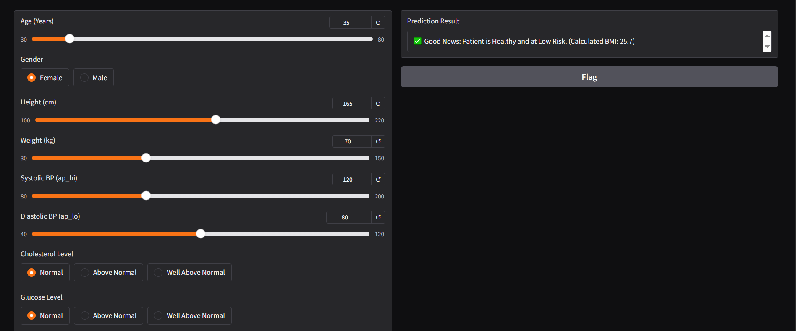
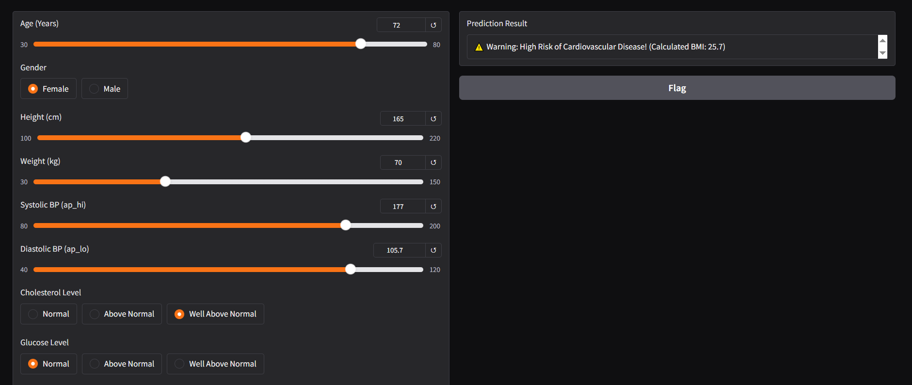

# Real-Time Cardiovascular Disease Prediction System using Machine Learning

> **Project Video Presentation & Live Demo:** [Watch the Demo Video on Google Drive](https://drive.google.com/file/d/1Dk3SJwMojLWcsl0JtHaPXY1H-n9ZeTUW/view?usp=sharing)

This repository contains an end-to-end Machine Learning pipeline designed to explore, preprocess, model, and deploy a predictive system for cardiovascular diseases. 
---

##  Project Team Members
* **Basmala Ali Mahmoud** 
---

##  Dataset Overview & Source
The project utilizes a clinical dataset containing comprehensive cardiovascular health metrics.
* **Initial Dimensions:** ~70,000 patient records and 13 structural columns.
* **Dataset Original Source & Download Link:**  [Cardiovascular Disease Dataset on Kaggle](https://www.kaggle.com/datasets/sulianova/cardiovascular-disease-dataset)
* **Note:** For evaluation purposes, the tracking data file `cardio_train.csv` is also provided within this workspace directory.
* **Key Features Analyzed:** Age, Blood Pressure (Systolic/Diastolic), Cholesterol, Glucose levels, Smoking status, Alcohol consumption, Physical activity, and calculated BMI.

---

##  Machine Learning Pipeline Implemented
1. **Exploratory Data Analysis (EDA):** Analyzed data distributions, identified outliers in blood pressure readings, and mapped correlation matrices.
2. **Data Preprocessing & Cleansing:** Handled missing/corrupted values, corrected blood pressure physiological anomalies, and performed feature scaling (`StandardScaler`) for linear models.
3. **Feature Engineering:** Strategically introduced a new engineered feature (**BMI**) combining clinical attributes to capture interactive biological risks.
4. **Predictive Modeling:** Evaluated three distinct algorithms to ensure optimal performance bounds:
   * Logistic Regression
   * Decision Tree Classifier
   * Random Forest Classifier (**The Winning Model**)

---

##  Model Performance Results
We evaluated multiple models using an 80-20 stratified training and validation partition setup. The test accuracy metrics are as follows:

1. **Logistic Regression (Baseline):** `71.60%` Accuracy
2. **Decision Tree Classifier (Depth=6):** `72.84%` Accuracy
3. **Random Forest Classifier (Champion Model):** **`73.23%`** Accuracy 

The Random Forest model was selected for application deployment because it strikes the best balance for generalizability and maintains robust evaluation bounds (Precision: $\ge 0.73$, Recall: $\ge 0.74$, F1-Score: $\sim 0.73$).
---

##  Web Application Interface (Gradio Deployment)
The winning model has been serialized into a `heart_disease_rf_model.pkl` file and deployed via a dynamic **Gradio** web interface (`app.py`). The interface allows medical professionals to interactively slide and enter a patient's vital metrics to obtain real-time cardiovascular risk assessments based on two contrasting clinical scenarios (Healthy vs. High-Risk).

---

## Deployed Application Showcases & Scenarios

To demonstrate how the interface dynamically consumes the optimized model, here are the testing showcases reflecting the two contrasting real-time scenarios:

### Scenario 1: Healthy Patient Assessment (Low Risk Target)
When normal clinical measurements (Blood Pressure: 120/80, Normal Cholesterol, and younger age) are supplied, the interface outputs a clear healthy classification.



### Scenario 2: High-Risk Cardiovascular Assessment (High Risk Warning)
In contrast, adjusting the input metrics to simulate high-risk factors (Advanced Age, Elevated Blood Pressure: 177/105, and Well Above Normal Cholesterol) instantly triggers an operational warning flag.


---

##  Repository Structure
* `ML_Project Basmala Ali.ipynb` : The full data science workflow notebook.
* `app.py` : Script running the interactive Gradio web deployment.
* `heart_disease_rf_model.pkl` : The serialized, production-ready Random Forest model.
* `cardio_train.csv` : workspace dataset samples.
* `requirements.txt` : The list of software packages and dependencies.
* `README.md` : Project documentation guide (This file).

---

---

##  Installation & Dependency Requirements
To run this project locally, you need to set up the environment and install the pinned core software library packages specified in the `requirements.txt` file.

### Required Libraries & Frameworks:
* `gradio==3.35.2` : Web framework used for creating the live interactive dashboard UI.
* `scikit-learn==1.2.2` : Machine learning framework used for model inference and preprocessing.
* `pandas==2.0.3` : Data structures tool used for standardizing structured inputs into DataFrames.
* `numpy==1.24.3` : Array processing library for handling data matrices.
* `joblib==1.2.0` : Object serialization tool used to instantly load the saved model file.
* `matplotlib==3.7.1` & `seaborn==0.12.2` : Data visualization and exploratory plotting libraries.

---

##  Step-by-Step Guide: How to Run the Project Locally

Follow these sequential terminal commands to pull the repository and launch the application on your machine:

### Step 1: Clone the Repository
Clone this workspace into your local machine environment:
```bash
git clone [https://github.com/YOUR_GITHUB_USERNAME/YOUR_REPOSITORY_NAME.git](https://github.com/YOUR_GITHUB_USERNAME/YOUR_REPOSITORY_NAME.git)
cd YOUR_REPOSITORY_NAME

##  How to Run the App Locally

### 1. Install dependencies:
```bash
pip install -r requirements.txt
